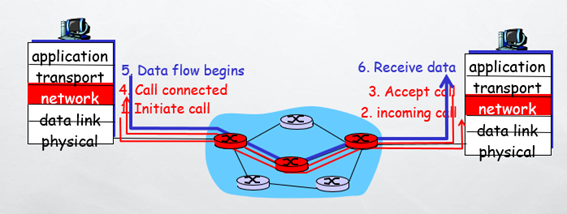
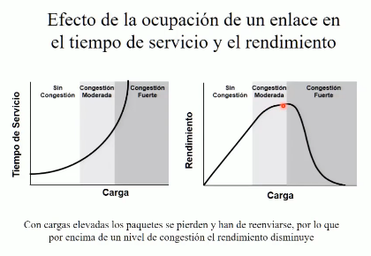
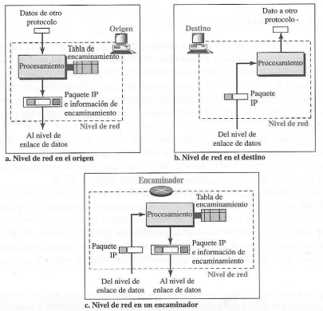
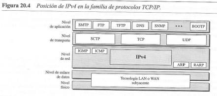
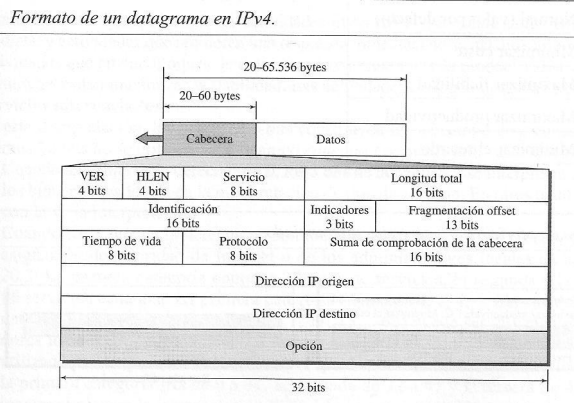
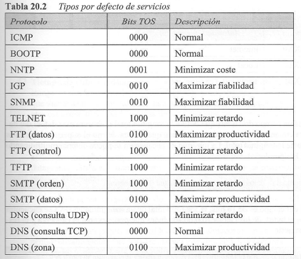
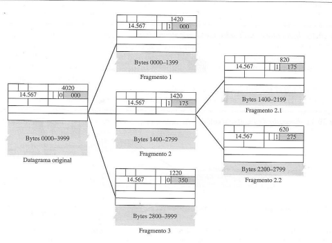

##### <mark>***samuca***</mark>
<!-- omit in toc -->
# ***Resumen Parcial 3 Redes***
<!-- omit in toc -->
## Índice

- [Aspectos Generales L3](#aspectos-generales-l3)
  - [Modelos de servicios de red](#modelos-de-servicios-de-red)
    - [CONS: Connection Oriented Network Service | Modelo direccionamiento de Circuito Virtual](#cons-connection-oriented-network-service--modelo-direccionamiento-de-circuito-virtual)
    - [CLNS: ConnectionLess Network Service | Modelo de direccionamiento de datagramas](#clns-connectionless-network-service--modelo-de-direccionamiento-de-datagramas)
  - [CLNS Forouzan](#clns-forouzan)
    - [Internet como una red de datagramas](#internet-como-una-red-de-datagramas)
    - [Internet como una red no orientada a conexión](#internet-como-una-red-no-orientada-a-conexión)
  - [Funciones del nivel de Red](#funciones-del-nivel-de-red)
- [Tiempos de servicio](#tiempos-de-servicio)
  - [Propiedades del tiempo de servicio](#propiedades-del-tiempo-de-servicio)
  - [Diseño de capacidad de una red](#diseño-de-capacidad-de-una-red)
- [Protocolo de Internet](#protocolo-de-internet)
  - [Interconexión entre redes](#interconexión-entre-redes)
    - [Necesidad del nivel de red](#necesidad-del-nivel-de-red)
  - [IPv4](#ipv4)
    - [Datagrama](#datagrama)
      - [Fragmentación](#fragmentación)
        - [Unidad de transferencia máxima (MTU)](#unidad-de-transferencia-máxima-mtu)
        - [Campos relacionados con la fragmentación](#campos-relacionados-con-la-fragmentación)
      - [Opciones](#opciones)

# Aspectos Generales L3

- La capa de red es la capa que se encarga del direccionamiento de los paquetes a través de los diferentes caminos que forman la Internet.
- Su función principal es el direccionamiento.
- Se constituye con enlaces que interconectan dos tipos de nodos:
  - Hosts
  - Routers
- Los routers tienen varias interfaces y los hosts (generalmente) una.
- Cuando se comunican dos hosts en una misma LAN, la capa 3 es casi inexistente.
- De esto se encargan los conmutadores de capa 2, puentes o L2 switches.
- Cuando un hosts quiere comunicarse con otro, en el transcurso del paquete por la red la cabecera de capa 2 cambiará cada vez que llegue a un nodo (exceptuando los conmutadores, que solo revisan la cabecera de capa 2 y en base a esto toman la decisión de reenvío de la trama), ahora, en capa 3, cada que el paquete pase por un Router, el mismo revisará la cabecera de capa 3 y en base a la información contenida en la misma decidirá que hacer con el paquete, si descartarlo o redireccionarlo hacia alguna de sus interfaces basado en la información almacenada en su tabla de enrutamiento. Esto es, la dirección IP origen y destino de un paquete NO cambia en el transcurso del paquete desde su origen hacia su destino.
- ARP es un protocolo de capa 3.
- IP es un protocolo enrutado (routed) de capa 3.
- RIP, EIGRP, IGRP, OSPF, IS-IS, BGP son protocolos (dinámicos) de enrutamiento (routing protocols) de capa 3.
- IP es un protocolo enrutado de capa 3 NO ORIENTADO A CONEXIÓN.
- Los protocolos no orientados a conexión funcionan con datagramas, se toman decisiones de direccionamiento cada vez que un paquete llega a un Router.
- Los protocolos orientados a conexión establecen una conexión cada vez que se va a iniciar una transmisión, toman las decisiones de direccionamiento una sola vez y una vez establecida la conexión no se vuelven a tomar decisiones de direccionamiento, funcionan con PVC’s, o permanente virtual circuits, circuitos virtuales.
- El funcionamiento de los protocolos de capa 3 enrutados orientados a conexión es casi igual que el de los protocolos orientados a conexión de capa 2 como Frame relay o ATM.
- Actualmente se utiliza (casi) siempre protocolos de capa 3 no orientados a conexión, y el predominante es el protocolo de Internet, (IP; Internet Protocol)
- El hecho de que IP sea no orientado a conexión significa que tienen una máxima del mayor esfuerzo, los paqutes pueden llegar desordenados o perderse en el camino y quien se encargará de controlar esto es la capa superior (si es que se utiliza un protocolo de capa 4 orientado a conexión como lo es TCP)
- Los servicios de transmisión son 3:
  - Prioridad; ej.: mensajes de control
  - QoS (Calidad de servicio); umbral de retardo máximo o umbral de requerimiento mínimo
  - Seguridad; restricción de accesos
- El protocolo IP busca no agregar demasiada información redundante a los paquetes, reduce el overhead.

## Modelos de servicios de red

Un modelo de servicio de red define las características del transporte terminal a terminal. Esto es, si la entrega es garantizada o no, si se garantiza el retardo mínimo o no, si los paquetes se entregan en orden, cual es el ancho de banda mínimo garantizado y cuales son los servicios de seguridad que ofrece.

En la realidad, en el Internet se utiliza el protocolo IP que hace uso del servicio del mejor esfuerzo.

### CONS: Connection Oriented Network Service | Modelo direccionamiento de Circuito Virtual

Se establece una conexión antes de iniciar la transmisión. Ej.: modelo de direccionamiento de circuito virtual.

En este modelo cada VC consta de una ruta, números de vc y entradas en las tablas de reenvío de los routers.

En la conexión, la capa de red define la ruta entre el emisor y el receptor, el número de VC para cada ruta del enlace, añade una entrada a la tabla de reenvío de los routers y puede reservar recursos.

Ejemplo:

Cabe destacar que esto no es lo mismo que una red de circuitos, sigue siendo una red conmutada pero con circuitos virtuales, la diferencia con una red conmutada es que no existe reserva de recursos, el circuito es virtual, esto es, en torno a la toma de decisiones de direccionamiento y no de reserva de un canal físico.

### CLNS: ConnectionLess Network Service | Modelo de direccionamiento de datagramas

Este es el modelo utilizado en la realidad, no garantiza la entrega de los paquetes en orden, ni la entrega en sí misma, el mejor esfuerzo hace referencia a que se intenta hacer lo mejor posible por llevar el paquete desde el origen hasta el destino pero no se asegura nada, esta responsabilidad se delega sobre las capas superiores (generalmente la capa de transporte cuando se utiliza el protocolo de capa 4 TCP que es orientado a conexión y es quien se encargará de establecer la conexión lógica en una comunicación entre dos estaciones.

Un servicio CLNS es recomendable cuando la red es poco fiable, por el hecho de que si falla un Router en el camino de un paquete hacia su destino, el mismo podrá tomar otra dirección.

Por el contrario si se utiliza un servicio CONS y falla un Router el paquete no podrá llegar a su destino, por lo que son utilizados cuando la red es muy fiable, como pasa en las redes de telefonía, donde por el contrario, en la capa superior se utiliza un protocolo no orientado a conexión como lo es el UDP.

Algunas de las diferencias de el modelo de direccionamiento de datagramas con respecto al modelo de direccionamiento por circuitos virtuales son las siguientes:

- Cuando una estación quiere enviar un paquete le agrega dirección de origen y destino (dirección IP)
- No se realiza configuración de circuito virtual previa.
- Los routers no mantienen información de estado.
- Cada Router tiene una tabla de reenvío donde asigna direcciones de destino a interfaces de enlace para saber sobre que interfaz debe redireccionar un paquete que se destina a una red determinada.
- Se utiliza un prefijo de red que es la parte de la dirección IP que determina la dirección de red.

## CLNS Forouzan

### Internet como una red de datagramas

En Internet, el nivel de enlace de red es una red de conmutación de paquetes. En general, la conmutación se puede dividir en tres amplias categorías: conmutación de circuitos, conmutación de paquetes y conmutación de mensajes. La conmutación de paquetes utiliza circuitos virtuales o datagramas.

En internet se ha elegido el enfoque basado en datagramas para la conmutación en el nivel de red. Utiliza una dirección universal definida en el nivel de red para encaminar paquetes del origen al destino.

### Internet como una red no orientada a conexión

La entrega de un paquete se puede realizar utilizando un servicio de red orientado a conexión o uno no orientado a conexión. En un servicio orientado a conexión, el origen establece en primer lugar una conexión con el destino antes de enviar el paquete. Cuando la conexión se establece, se puede enviar una secuencia de paquete s del mismo origen al mismo destino. En este caso, hay una relación entre los paquetes. Se envían por el mismo camino en orden secuencial. Un paquete se encuentra conectado lógicamente con el paquete que viaja delante de él y con el que viaja detrás de el. Cuando se han entregado todos los paquetes de un mensaje, se finaliza la conexión.

En un protocolo orientado a conexión, la decisión sobre el camino de una secuencia de paquetes con la misma dirección origen y destino se puede hacer una sola vez, cuando se establece la conexión. Los conmutadores no recalculan el camino para cada paquete individual. Este tipo de servicio utiliza el enfoque de circuitos virtuales para la conmutación de paquetes, como Frame Relay y ATM.

En un servicio no orientado a conexión, el protocolo de nivel de red trata cada paquete de forma independiente y los paquetes no tienen relación entre ellos. Los paquetes de un mensaje pueden viajar o no por el mismo camino hasta el destino. Este tipo de servicio utiliza el enfoque basado en datagramas para la conmutación de paquetes. En Internet se ha elegido este tipo de servicio en el nivel de red.

La razón de esta decisión es que Internet está compuesto de tantas redes heterogéneas que casi siempre es imposible crear una conexión desde un origen a un destino sin conocer por adelantado la naturaleza de las redes.

## Funciones del nivel de Red

- Elegir la ruta óptima de los paqutes.
  - En CONS solo al momento de establecer el VC.
  - En CLNS cada vez que un paquete llega a un Router.
- Controlar y evitar la congestión. (NC); Criterios de descarte de paquetes.
- Controlar que el usuario no abuse del servicio (QoS)
- Resolver las direcciones del nivel de red con las del nivel de enlace (ARP)

# Tiempos de servicio

Para entender los tiempos de servicio primero hay que entender los tiempos utilizados en la transmisión de datos:

- Tiempo de transmisión (Tt): es el tiempo que tarde un paquete en ser emitido por una interfaz. Se calcula en base al tamaño del paquete (p; en bits) sobre la velocidad de la línea (v;bw – bits/s)
- Tiempo de propagación (t): es el tiempo que tarda un bit en viajar desde la interfaz de origen a la de destino. Depende del medio, esto es, distancia (longitud del cable si es patch cord o fibra óptica) y tipo (cobre, fibra o aire).
- Tiempo de entrega o latencia (Te): es la suma del tiempo de transmisión y el de propagación.
- Tiempo de espera (Tesp): es el tiempo que el paquete espera haciendo cola en la interfaz de entrada del Router hasta que le llega su turno. El tiempo de espera depende del grado de congestión en la interfaz de salida.

Entonces:

- Tiempo de servicio (Ts = Tesp + Tt): es el tiempo que transcurre desde que el paquete llega por la interfaz de entrada (se pone en cola) hasta que se emite por la interfaz de salida. No incluye el tiempo de propagación.
- Por teoría de colas puede demostrarse que:
  - Ts = p/(v-c)
  - P = tamaño del paquete (en bits)
  - Siendo v = velocidad nominal o capacidad de la línea en bits/s.
  - y c = tráfico real de la línea en bits/s.
- Esto es, si un paqute de 500 bytes entra en una línea de 64Kb/s que esta ocupada en un 50%:
  - p = 4000, v = 64000, c = 32000  Ts = 125ms

## Propiedades del tiempo de servicio

Ts = p/(v-c)  Tt = p/v
• Si c = 0, es decir que la línea no tiene tráfico, entonces el tiempo de transmisión es igual al tiempo de servicio.
• Cuando la velocidad de una línea  es elevada podemos llegar a niveles altos de ocupación sin incurrir en tiempos de servicio excesivos.

## Diseño de capacidad de una red

Desde un punto de vista de optimizar recursos lo ideal es que los enlaces tengan un nivel de congestión moderada. Una congestión excesiva provoca la pérdida y reenvío de paquetes, el fallo de protocolos de alto nivel y la frustración de los usuarios.

La ausencia de congestión indica un sobredimensionamiento, lo cual podría significar un derroche de recursos. Hay que tener en cuenta las necesidades y la evolución de tráfico al o largo del día, lo razonable es dimensionar tomando en cuenta las necesidades en horas punta.

# Protocolo de Internet

En el modelo de Internet, el principal protocolo de red es el Protocolo de Internet (IP). La versión actual y dominante es la versión 4 o IPv4, la siguiente generación es IPv6 que no se implementa mucho en la actualidad.

## Interconexión entre redes

Los niveles físico y de enlace de datos de una red funcionan localmente. Estos dos niveles se responsabilizan de la entrega de datos en la red de un nodo al siguiente, como se muestra en la siguiente figura:

Esta interconexión entre redes se hace a partir de cinco redes: cuatro LAN y una WAN. Si el host A necesita enviar un paquete de datos al host D, el paquete necesita ir primero de A a R1 (un conmutador o encaminador), luego de R1 a R3, y finalmente de R3 al host D.

Se dice que el paquete de datos pasa a través de tres enlaces. En cada enlace, se involucran dos niveles físicos y dos niveles de enlace de datos.

Sin embargo, hay un gran problema. Cuando llegan datos a la interfaz f1 de R1, ¿Cómo sabe R1 que la interfaz de salida es f3? No hay nada en el nivel de enlace de datos (o físico) para ayudar a R1 a tomar la decisión adecuada. La trama no transporta ninguna información de encaminamiento. La trama contiene la dirección MAC de A como fuente y la dirección MAC de R1 como destino. Para una LAN o una WAN, la entrega significa transportar la trama a través de un enlace y no más allá.

### Necesidad del nivel de red

Para solucionar el problema de la entrega a través de varios enlaces, se ha diseñado el nivel de red (o el nivel de interconexión entre redes). <mark>**El nivel de red es responsable de la entrega host a host y del encaminamiento de los paquetes a través de los encaminadores o conmutadores.**</mark>

La siguiente figura muestra la misma red anterior pero con un nivel de red añadido:

La siguiente figura muestra la idea general de la funcionalidad del nivel de red en el origen, en el encaminador y en el destino.

El nivel de red en el origen es responsable de crear un paquete a partir de los datos que vienen de otro protocolo (como el protocolo de transporte o un protocolo de encaminamiento). La cabecera del paquete contiene, entre otra información, las direcciones lógicas del origen y del destino. El nivel de red es responsable de comprobar su tabla de encaminamiento para encontrar la información de encaminamiento (tales como la interfaz de salida o la dirección física del siguiente nodo). Si el paquete es demasiado grande se fragmenta.

El nivel de red en el Router es responsable de encaminar el paquete. Cuando llega un paquete, el Router consulta su tabla de enrutamiento y encuentra la interfaz por la que el paquete debe ser enviado. El paquete, después de algunos cambios en la cabecera, se pasa de nuevo al nivel de enlace de datos con la información de encaminamiento. Cabe destacar que estos cambios en la cabecera no implican cambios en los campos de direcciones.

El nivel de red en el destino es responsable de la verificación de la dirección; se asegura que la dirección de destino del paquete es la misma que la dirección de red del host.  Si el paquete es un fragmento, el nivel de red espera hasta que todos los fragmentos han llegado y los reensambla y entrega los paquetes reensamblados al nivel de transporte.

## IPv4

La versión 4 del protocolo de Internet(IPv4) es un mecanismo de entrega utilizado en los protocolos TCP/IP. La siguiente figura muestra la posición de IPv4 en esta familia de protocolos.

IPv4 es un protocolo de datagramas no orientado a conexión y no fiable, utiliza un servicio de mejor entrega posible. El término *mejor posible* significa que IPv4 no ofrece control de errores ni control de flujo (sólo para la detección de errores en la cabecera). IPv4 asume la no fiabilidad de los niveles inferiores y hace lo mejor que puede para conseguir la transmisión al destino pero sin garantías. 

Si la fiabilidad es importante, IPv4 debe emparejarse con un protocolo fiable como TCP. 

IPv4 es también un protocolo no orientado a conexión para una red de conmutación de paquetes que utiliza datagramas. Esto significa que cada datagrama se trata de forma independiente y cada datagrama puede seguir un camino diferente hasta el destino. Esto implica que los datagramas enviados por el mismo origen al mismo destino pueden llegar desordenados. También, algunos pueden perderse o dañarse durante la transmisión. De nuevo, IPv4 depende de un protocolo de nivel superior que se preocupe de estos problemas.

### Datagrama

Los paquetes en IPv4 se denominan datagramas. 

Un datagrama es un paquete de longitud variable que consta de dos partes: cabecera y datos. La cabecera tiene de 20 a 60 bytes de longitud y contiene información esencial para el encaminamiento y la entrega. En TCP/IP se muestra la cebecera en secciones de 4 bytes. 

A continuación se hace una descripción de cada campo en orden.

- Versión (VER): Este campo de 4 bits define la versión del protocolo IP. Actualmente la versión es la 4. Si se utiliza IPv6 este campo indica que se utiliza IPv6. Si se utiliza IPv4 este campo indica que todos los campos a continuación deben interpretarse de acuerdo a esta versión.
- Longitud de la cabecera (HLEN): Este campo de 4 bits define la longitud total de la cabecera del datagrama en palabras de 4 bytes. Este campo es necesario debido a que la longitud de la cabecera es variable (entre 20 y 60 bytes). Cuando no hay opciones, la cabecera tiene 20 bytes y el valor de este campo es 5. Cuando el campo opción está presente su tamaño es 15.
- Servicios: El IEFT cambió la interpretación y el nombre de este campo de 8 bits. Este campo, anteriormente denominado "tipo de servicio", se conoce ahora como "servicios diferenciados".
    1. Tipo de servicio
    > En esta interpretación, los 3 primeros bits se denominan bits de precedencia. Los siguientes 4 bits se denominan tipo de servicio (TOS) y el último no se utiliza
    - Precedencia
    >Es un subcampo de 3 bits con valores entre 0 y 7 (dec). La precedencia define la **prioridad** del datagrama en situaciones tales como congestión. Si un encaminador se encuentra congestionado y necesita descartar algunos datagramas, se descartarán primero aquellos con menor precedencia. Algunos datagramas en Internet son más importantes que otros. (Es el equivalente al DEI en las tramas Ethernet con dot1q tags)
    - Bit TOS
    >En este campo de 4 bits, cada bit tiene un significado especial. Aunque un bit puede ser 0 o 1, uno y sólo uno de estos bits puede tener el valor 1 en cada datagrama. Los patrones de bits y su interpretación se muestran en la siguiente tabla. Con sólo 1 bit a 1 al mismo tiempo se pueden tener cinco tipos diferentes de servicios.  
    Los programas de aplicación pueden solicitar un tipo específico de servicio:
    
    2. Servicios diferenciados
    > En esta interpretación, los primeros 6 bits constituyen un subcampo denominado codepoint, y los últimos 12 bits no se utilizan. El subcampo codepoint se puede utilizar de dos formas. 
    - a
    > Cuando los 3 bits de la derecha son 0, los 3 bits de la izquierda se interpretan igual forma que los bits de precedencia en la interpretación de TOS. En otras palabras, es compatible con la vieja interpretación.
    - b
    > Cuando los 3 bits de la derecha no son todos 0, los 6 bits definen 64 servicios basados en la asignación de prioridad de Internet o de los administradores locales de acuerdo a la siguiente tabla. 
    La primera categoría contiene 32 tipos de servicios, la segunda y la tercera contienen 16 servicios cada una. La primera categoría (números 0, 2, 4, ..., 62) son asignados por Internet (IEFT). La segunda categoría (3, 7 11, 15, ..., 63) puede ser utilizada por los administradores locales (organizaciones). La tercer categoría (1, 5, 9, ... 61) es temporal y puede ser utilizada para experimentación. 

- Longitud total: Este es un campo de 16 bits que define la longitud total (cabecera más datos) del datagrama en bytes. Para encontrar la longitud de los datos que vienen de nivel superior se resta la longitud de la cabecera de la longitud total. La longitud de la cabecera se puede obtener multiplicando el valor del campo HLEN por 4.
- Identificación: Este campo se utiliza en la fragmentación.
- Indicadores: este campo se utiliza en la fragmentación.
- Desplazamiento del fragmento: Este campo se utiliza en la fragmentación.
- Tiempo de vida: Un datagrama tiene un tiempo de vida limitado en su viaje a través de Internet. Este campo se diseñó originalmente para almacenar una marca de tiempo, que se reducía en uno cada vez que visitaba un encaminador. El datagrama se descartaba cuando el valor se hacía 0. Sin embargo, para este esquema, todas las másquinas deben tener sincronizados los relojes y deben conocer cuánto tarda un datagrama en ir de una máquina a otra. Hoy en día este campo se utiliza fundamentalmente para controlar el número máximo de saltos visitados por el datagrama. Cuando un host origen envía el datagrama, almacena un número en este campo. Este valor es aproximadamente 2 veces el número máximo de encaminadores entre cualquier par de hosts. Cada encaminador que procesa el datagrama resta a este número un 1. Si este valor, después de restarse, se hace 0, el encaminador descarta el datagrama.
Este campo es necesario debido a que las tablas de encaminamiento en Internet se pueden corromper. Un datagrama puede viajar entre dos o más encaminadores durante mucho tiempo sin ser entregado al destino. Este campo limita el tiempo de vida de un datagrama. Otro uso para este campo es limitar intencionalmente el viaje de un paquete. Por ejemplo, si el origen quiere confinar el paquete a la red local, puede almacenar 1 en este campo. Cuando el paquete llega al primer encaminador, este valor se hace 0 y se descarta el datagrama.
- Protocolo: Este campo de 8 bits define el protocolo de nivel superior que utiliza los servicios del nivel IPv4. Un datagrama IPv4 puede encapsular datos de varios protocolos superiores como TCP, UDP y QUIC (en L4) o en L3 ICMP, IGMP o protocolos de enrutamiento como OSPF, EIGRP, BGP, RIP, etc. Este campo especifica al protocolo de destino final al que se tiene que entregar el datagrama IPv4. En otras palabras, puesto que el protocolo IPv4 puede transportar datos de diferentes protocolos, el valor de este campo ayuda al nivel de red en el receptor a saber a qué protocolo pertenecen los datos. Algunos valores son 1-ICMP, 2-IGMP, 6-TCP, 17-UDP, 89-OSPF

- Suma de comprobación: solo protege la información de la cabecera. Checksum, usa el algoritmo CRC.
- Dirección origen: Este campo de 32 bits define la dirección IPv4 de un origen. El campo debe permanecer sin cambio durante todo el tiempo que el datagrama IPv4 viaja desde el origen hasta el destino.
- Dirección de destino: Este campo de 32 bits define la dirección IPv4 del destino. El campo debe permanecer sin cambio durante todo el viaje del datagrama desde el origen hasta el destino.

#### Fragmentación

Un datagrama puede viajar a través de diferentes redes. Cada encaminador extrae el datagrama IPv4 de la trama que recibe, la procesa y la encapsula en otra trama. El formato y el tamaño de la trama recibida dependen del protocolo utilizado por el nivel físico por el cual llega la trama. El formato y el tamaño de la trama enviada dependen del protocolo utilizado en el nivel físico de la red por la que se va a enviar la trama. Por ejemplo, si un encaminador conecta una LAN con una WAN, recibe la trama en el formato de la LAN y la envía en el formato de la WAN.

##### Unidad de transferencia máxima (MTU)

Cada protocolo de nivel de enlace de datos tiene su propio formato de trama en la mayoría de los protocolos. Uno de los campos definidos en el formato es el tamaño máximo del campo de datos. En otras palabras, cuando un datagrama se encapsula en una trama, el tamaño total del datagrama debe ser menor que este tamaño máximo, que está definido por restricciones impuestas por el hardware y software utilizados en la red.

El valor de la MTU depende del protocolo de red físico.

Para que el protocolo IPv4 sea independiente de la red física, los diseñadores decidieron hacer el MTU de un datagrama IPv4 igual a 65535. Esto hace la transmisión más eficiente cuando se utiliza un protocolo con una MTU de este tamaño. Sin embargo, para otras redes físicas, se debe dividir el datagrama para que pueda pasar a través de estas redes. A este proceso se lo llama **fragmentación**.

El origen normalmente no fragmenta el paquete IPv4. El nivel de transporte en su lugar segmentará los datos en un tamaño que se puedan acomodar en IPv4 y en el nivel de enlace de datos que usa.

Cuando se fragmenta un datagrama, cada fragmento tiene su propia cabecera con la mayoría de los campos repetidos, pero algunos cambiados. Un datagrama fragmentado puede fragmentarse si encuentra una red con una MTU aún más pequeña. En otras palabras, un datagrama puede fragmentarse varias veces hasta alcanzar su destino final.

En IPv4, un datagrama puede ser fragmentado por el host origen o por cualquier encaminador encontrado en el camino, aunque la tendencia es limitar la fragmentación sólo al origen. El reensamblado del datagrama, sin embargo, sólo se hace en el host destino debido a que cada fragmento es un datagrama independiente. Mientras que el datagrama fragmentado puede viajar a través de caminos diferentes y nunca se puede controlar o garantizar qué camino va a seguir un datagrama fragmentado, todos los fragmentos que pertenecesn al mismo datagrama deberíain finalmente llegar al host destino. Por tanto, es lógico hacer el proceso de reensamblado en el destino final. Una objeción aún más fuerte al proceso de reensamblado de paquetes durante la transmisión es la pérdida de eficiencia que produciría.

Cuando se fragmenta un datagrama, las partes necesarias de la cabecera deben ser copiadas en todos los fragmentos. El campo de opción puede o no ser copiado. El host o encaminador que fragmenta un datagrama debe cambiar el valor de traes campos: indicadores, desplazamiento del fragmento y longitud total. El resto de los campos deben ser copiados tal cual. Por supuesto, el valor del checksum debe volver a calcularse por cada fragmento del datagrama fragmentado.

##### Campos relacionados con la fragmentación

Los campos que se relacionan con la fragmentación y el reensamblado de un datagrama IPv4 son los campos de identificación, indicadores y de desplazamiento del fragmento.

- **Identificación**: este campo de 16 bits identifica un datagrama que procede de un host origen. La combinación de la identificación y de la dirección origen IPv4 deben definir de forma única un datagrama cuando deja el host origen. Para garantizar esta unicidad, el protocolo IPv4 utiliza un contador para etiquetar los datagramas. El contador se inicializa a un número positivo. Cuando el protocolo IPv4 envía un datagrama, copia el valor del contador en el campo de identificación e incrementa el contador en 1. Cuando se fragmenta un datagrama, el valor en el campo de identificación se copia a todos los fragmentos. En otras palabras, todos los fragmentos tienen el mismo número de identificación, el mismo que el datagrama original. El número de identificación ayuda al destino a reensamblar el datagrama. Sabe que todos los fragmentos que tienen la misma identificación deben ser ensamblados en un datagrama.
- **Indicadores**: este es un campo de 3 bits. El primer bit está reservado. El segundo bit se denomina *bit de no fragmentación*. Si su valor es 1, la máquina no debe fragmentar el datagrama. Si no puede pasar el datagrama a través de la red física disponible, lo descarta y envía un mensaje de errore ICMP al hsost origen. Si su valor es 0, el datagrama se puede fragmentar de ser necesario. El tercer bit se denomina *bit de más fragmentos*. Si su valor es 1, significa que el datagrama no es el último fragmento, hay más fragmentos después de él. Si su valor es 0, significa que éste es el último fragmento o que solo hay un fragmento.
- **Desplazamiento del fragmento**: Este campo de 13 bits muestra la posición relativa de este fragmento respecto al datagrama completo. Es el desplazamiento de los datos en el datagrama original medido en unidades de 8 bytes. Es decir, indica desde donde se debe comenzar a leer los datos tratando el datagrama completo.

#### Opciones

La cabecera de un datagrama IPv4 está compuesta de dos partes: una parte fija y una parte variable. La parte fija tiene una longitud de 20 bytes. La parte variable comprende las opciones que pueden ocupar un máximo de 40 bytes.

Las opciones, como su nombre implica, no son requeridas para un datagrama. Se pueden utilizar para probar y depurar la red. Aunque las opciones no son una parte obligatoria de la cabecera de un datagrama IPv4, el software sí requiere el procesamiento de las opciones. Esto significa que todas las implementaciones deben ser capaces de tratar las opciones cuando se encuentren presentes en la cabecera.

