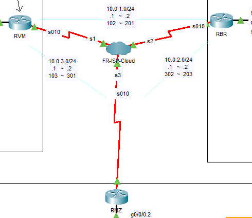

# Consigna

- ABCDEFGHIJKLMNÑOPQRSTUVWXYZ
- ABCDEFGHIJKLMNÑOPQRSTUVWXYZ 
- ABCDEFGHIJKLMNÑOPQRSTUVWXYZ 
- ABCDEFGHIJKLMNÑOPQRSTUVWXYZ 
- ABCDEFGHIJKLMNÑOPQRSTUVWXYZ 
- ABCDEFGHIJKLMNÑOPQRSTUVWXYZ 
- ABCDEFGHIJKLMNÑOPQRSTUVWXYZ 
- ABCDEFGHIJKLMNÑOPQRSTUVWXYZ 
- ABCDEFGHIJKLMNÑOPQRSTUVWXYZ 
- ABCDEFGHIJKLMNÑOPQRSTUVWXYZ 
- ABCDEFGHIJKLMNÑOPQRSTUVWXYZ 
- ABCDEFGHIJKLMNÑOPQRSTUVWXYZ 
- ABCDEFGHIJKLMNÑOPQRSTUVWXYZ 
- ABCDEFGHIJKLMNÑOPQRSTUVWXYZ 
- ABCDEFGHIJKLMNÑOPQRSTUVWXYZ 
- ABCDEFGHIJKLMNÑOPQRSTUVWXYZ 
- ABCDEFGHIJKLMNÑOPQRSTUVWXYZ 

# WAN
Para establecer la conexión entre las 3 ciudades, debíamos utilizar una WAN Frame-Relay. Para esto establecimos 3 circuitos virtuales formando una topología full-mesh entre los 3 routers. 

Cada uno de los routers fue conectado mediante un cable serial a la nube frame relay del ISP. En la interfaz serial de cada uno de estos routers se configuraron dos interfaces virtuales con encapsulamiento frame-relay. De este modo la conexión lógica entre los 3 routers es directa (PaP). 

| **Router** | **Interfaz Física** | **Interfaz Virtual** | **Dirección de capa 2 (DLCI)** | **Dirección de capa 3 (IPv4)** | **Dirección de red** |
|------------|---------------------|----------------------|--------------------------------|--------------------------------|----------------------|
| **RVM**    | serial 0/1/0        | s 0/1/0.102          | 102                            | 10.0.1.1/24                    | 10.0.1.0/24          |
| **RVM**    | serial 0/1/0        | s 0/1/0.103          | 103                            | 10.0.3.1/24                    | 10.0.3.0/24          |
| **RBR**    | serial 0/1/0        | s 0/1/0.201          | 201                            | 10.0.1.2/24                    | 10.0.1.0/24          |
| **RBR**    | serial 0/1/0        | s 0/1/0.203          | 203                            | 10.0.2.2/24                    | 10.0.2.0/24          |
| **RMZ**    | serial 0/1/0        | s 0/1/0.301          | 301                            | 10.0.3.2/24                    | 10.0.3.0/24          |
| **RMZ**    | serial 0/1/0        | s 0/1/0.302          | 302                            | 10.0.2.1/24                    | 10.0.2.0/24          |

> ***Topología lógica*** <br/>
> 

Para que esto funcione tuvimos que también configurar los circuitos virtuales (PVCs) en la nube Frame Relay:
> ***Circuitos virtuales*** <br/>
> 

La configuración de las interfaces seriales involucradas en cada uno de los routers fueron las siguientes:
> RVM:
> ``` code
> interface Serial0/1/0
>  no ip address
>  encapsulation frame-relay
> !
> interface Serial0/1/0.102 point-to-point
>  ip address 10.0.1.1 255.255.255.0
>  frame-relay interface-dlci 102
>  clock rate 2000000
> !
> interface Serial0/1/0.103 point-to-point
>  ip address 10.0.3.1 255.255.255.0
>  frame-relay interface-dlci 103
>  clock rate 2000000
> !
> ```
> RBR:
> ``` code
> interface Serial0/1/0
>  no ip address
> encapsulation frame-relay
> !
> interface Serial0/1/0.201 point-to-point
>  ip address 10.0.1.2 255.255.255.0 
>  frame-relay interface-dlci 201
>  clock rate 2000000
> !
> interface Serial0/1/0.203 point-to-point
>  ip address 10.0.2.2 255.255.255.0
>  frame-relay interface-dlci 203
>  clock rate 2000000
> !
> ```
> RMZ:
> ``` code	
> interface Serial0/1/0
>  no ip address
>  encapsulation frame-relay
> !
> interface Serial0/1/0.301 point-to-point
>  ip address 10.0.3.2 255.255.255.0
>  frame-relay interface-dlci 301
>  clock rate 2000000
> !
> interface Serial0/1/0.302 point-to-point
>  ip address 10.0.2.1 255.255.255.0
>  frame-relay interface-dlci 302
>  clock rate 2000000
> !
> ```


