<!-- omit in toc -->
# Datos
- Nombre: Samuel Andrés
- Legajo: 12953
- Materia: Redes de Información
- TP: Trabajo Práctico Integrador
- UTN-FRVM - 2022
<!-- omit in toc -->
# Índice
- [Consigna](#consigna)
- [WAN](#wan)
  - [Configuración y vista lógica](#configuración-y-vista-lógica)
  - [Vista física](#vista-física)
- [LANs](#lans)
  - [Vista lógica](#vista-lógica)
  - [VLANs](#vlans)
  - [DHCP](#dhcp)
    - [Villa María](#villa-maría)
      - [Router WiFi](#router-wifi)
    - [Bariloche](#bariloche)
    - [Mendoza](#mendoza)
  - [Tablas de resumen](#tablas-de-resumen)
- [Configuración de protocolo dinámico de enrutamiento](#configuración-de-protocolo-dinámico-de-enrutamiento)
- [Vista Lógica Total](#vista-lógica-total)

# Consigna

- Interconectar 3 Redes LAN de una compañía con sede en 3 ciudades diferentes:
  - Villa María
  - Bariloche
  - Mendoza
- La conexión entre las Redes LAN debe ser mediante WAN Frame Relay
- Cada red LAN debe tener:
  - 3 VLANS:
    - VLAN2: 2 PCS
    - VLAN3: 1 PC y una impresora
    - VLAN4: 1 Notebook y 1 Tablet (Conexión Wireless mediante un Router WiFi WRT-300N)
    - Asignación de IPS mediante DHCP

# WAN

## Configuración y vista lógica

Para establecer la conexión entre las 3 ciudades, debíamos utilizar WAN Frame-Relay. Para esto establecimos 3 circuitos virtuales formando una topología full-mesh entre los 3 routers. 

Cada uno de los routers fue conectado mediante un cable serial a la nube frame relay del ISP. En la interfaz serial de cada uno de estos routers se configuraron dos interfaces virtuales con encapsulamiento frame-relay. De este modo la conexión lógica entre los 3 routers es directa (PaP). 

| **Router** | **Interfaz Física** | **Interfaz Virtual** | **Dirección de capa 2 (DLCI)** | **Dirección de capa 3 (IPv4)** | **Dirección de red** |
|------------|---------------------|----------------------|--------------------------------|--------------------------------|----------------------|
| **RVM**    | serial 0/1/0        | s 0/1/0.102          | 102                            | 10.0.1.1/24                    | 10.0.1.0/24          |
| **RVM**    | serial 0/1/0        | s 0/1/0.103          | 103                            | 10.0.3.1/24                    | 10.0.3.0/24          |
| **RBR**    | serial 0/1/0        | s 0/1/0.201          | 201                            | 10.0.1.2/24                    | 10.0.1.0/24          |
| **RBR**    | serial 0/1/0        | s 0/1/0.203          | 203                            | 10.0.2.2/24                    | 10.0.2.0/24          |
| **RMZ**    | serial 0/1/0        | s 0/1/0.301          | 301                            | 10.0.3.2/24                    | 10.0.3.0/24          |
| **RMZ**    | serial 0/1/0        | s 0/1/0.302          | 302                            | 10.0.2.1/24                    | 10.0.2.0/24          |

> ***Vista lógica*** <br/>
> 

Para que esto funcione tuvimos que también configurar los circuitos virtuales (PVCs) en la nube Frame Relay:
> ***Circuitos virtuales*** <br/>
> 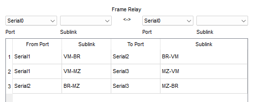

La configuración de las interfaces seriales involucradas en cada uno de los routers fueron las siguientes:
> RVM:
> ``` code
> interface Serial0/1/0
>  no ip address
>  encapsulation frame-relay
> !
> interface Serial0/1/0.102 point-to-point
>  ip address 10.0.1.1 255.255.255.0
>  frame-relay interface-dlci 102
>  clock rate 2000000
> !
> interface Serial0/1/0.103 point-to-point
>  ip address 10.0.3.1 255.255.255.0
>  frame-relay interface-dlci 103
>  clock rate 2000000
> !
> ```
> RBR:
> ``` code
> interface Serial0/1/0
>  no ip address
> encapsulation frame-relay
> !
> interface Serial0/1/0.201 point-to-point
>  ip address 10.0.1.2 255.255.255.0 
>  frame-relay interface-dlci 201
>  clock rate 2000000
> !
> interface Serial0/1/0.203 point-to-point
>  ip address 10.0.2.2 255.255.255.0
>  frame-relay interface-dlci 203
>  clock rate 2000000
> !
> ```
> RMZ:
> ``` code	
> interface Serial0/1/0
>  no ip address
>  encapsulation frame-relay
> !
> interface Serial0/1/0.301 point-to-point
>  ip address 10.0.3.2 255.255.255.0
>  frame-relay interface-dlci 301
>  clock rate 2000000
> !
> interface Serial0/1/0.302 point-to-point
>  ip address 10.0.2.1 255.255.255.0
>  frame-relay interface-dlci 302
>  clock rate 2000000
> !
> ```

## Vista física

En el mapa de Argentina la topología física se ve de la siguiente manera, considerando que la nube Frame Relay es una representación lógica:

>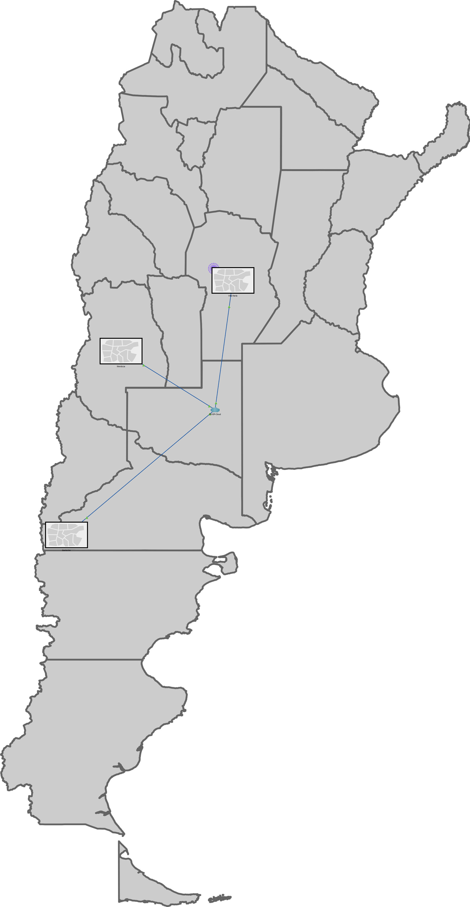

Luego, dentro de cada oficina, en cada edificio de cada ciudad, se encuentra un habitación de cableado con un RACK, donde, entre otras cosas, está el Router, con la conexión serial:

>***Villa María*** <br/>
>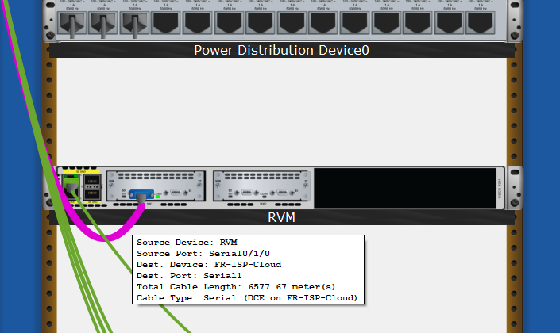 <br/>
>***Bariloche*** <br/>
>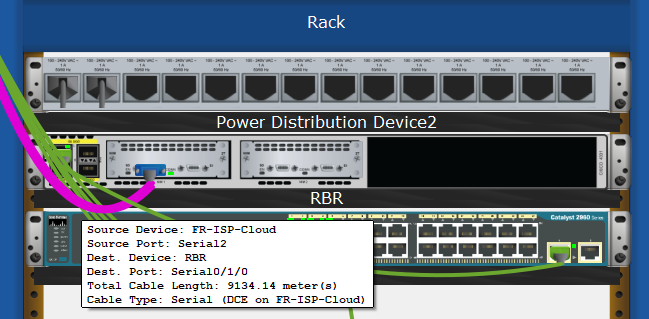 <br/>
>***Mendoza*** <br/>
>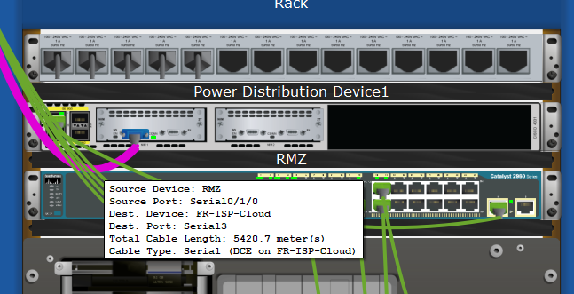 <br/>

# LANs

## Vista lógica

La vista lógica de la LAN de Villa María se ve de la siguiente manera: <br/> 
> 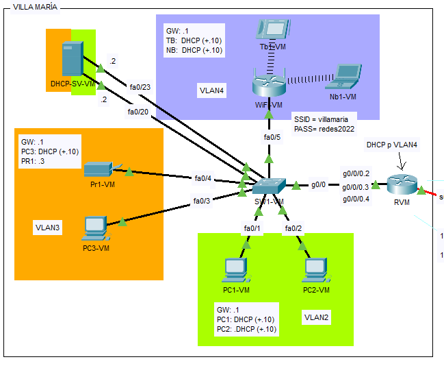

La vista lógica de la LAN de Bariloche se ve de la siguiente manera: <br/> 
> 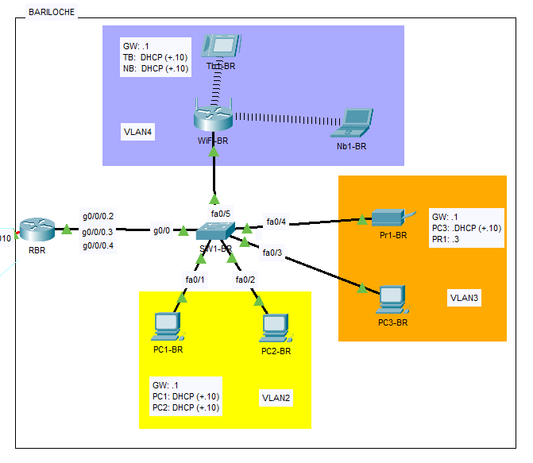

La vista lógica de la LAN de Mendoza se ve de la siguiente manera: <br/> 
> 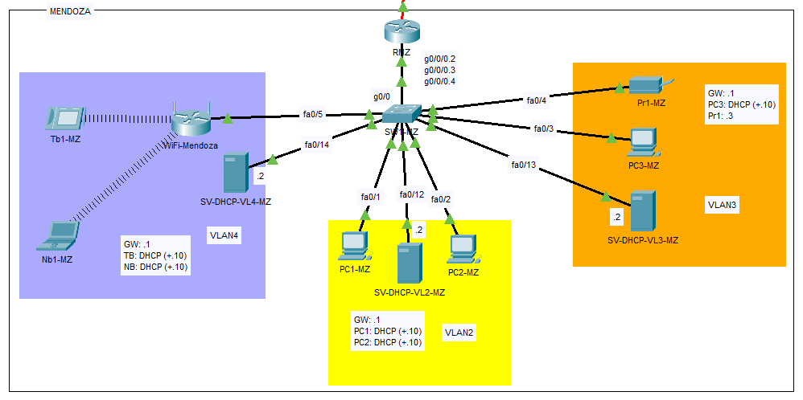

## VLANs

Lo primero fue crear las VLANs en cada switch:
> VM
> ``` code
> SW1-VM(config)#vlan 2
> SW1-VM(config-vlan)#name VLAN2
> SW1-VM(config)#vlan 3
> SW1-VM(config-vlan)#name VLAN3
> SW1-VM(config)#vlan 4
> SW1-VM(config-vlan)#name VLAN4
> ```
> BR
> ``` code
> SW1-BR(config)#vlan 2
> SW1-BR(config-vlan)#name VLAN2
> SW1-BR(config)#vlan 3
> SW1-BR(config-vlan)#name VLAN3
> SW1-BR(config)#vlan 4
> SW1-BR(config-vlan)#name VLAN4
> ```
> MZ
> ``` code
> SW1-MZ(config)#vlan 2
> SW1-MZ(config-vlan)#name VLAN2
> SW1-MZ(config)#vlan 3
> SW1-MZ(config-vlan)#name VLAN3
> SW1-MZ(config)#vlan 4
> SW1-MZ(config-vlan)#name VLAN4
> ```

Una vez creadas las VLANs lo siguiente fue asignar cada puerto (configurándolo en modo acceso) a la VLAN correspondiente:
> ***VM***
> ``` code	
> interface FastEthernet0/1
>  switchport access vlan 2
>  switchport mode access
> !
> interface FastEthernet0/2
>  switchport access vlan 2
>  switchport mode access
> !
> interface FastEthernet0/3
>  switchport access vlan 3
>  switchport mode access
> !
> interface FastEthernet0/4
>  switchport access vlan 3
>  switchport mode access
> !
> interface FastEthernet0/5
>  switchport access vlan 4
>  switchport mode access
> ```
> Además, por seguridad, desactivé todas las interfaces del Switch que no se utilizan. <br/>
> ***Resultando en:*** *ignorar DHCP incorporado más adelante <br/>
> 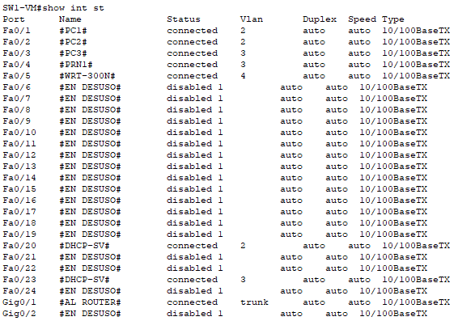 <br/>
> ***En Bariloche y Mendoza las configuraciones fueron exactamente las mismas, por lo que se muestra la VLAN DB en cada uno de estos:*** <br/>
> ***Bariloche*** <br/>
>  <br/>
> ***Mendoza*** <br/>
> 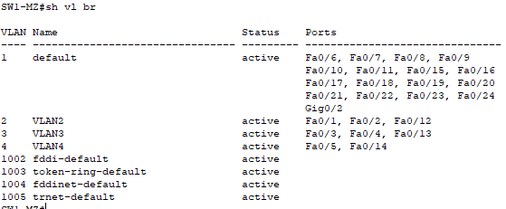 <br/>

Con estas configuraciones, en cada LAN hay conexión en capa 2, entre dispositivos que se encuentran en la misma VLAN, conectados al mismo Switch.

Ahora, lo que se quiere lograr es conectividad total, para esto empezamos por definir una subred para cada VLAN, el esquema de direcciones que establecimos en clase fue:
> ***10.LOC.VLAN.HOST*** <br/>
> Siendo: <br/>
> LOC 1 = Villa María <br/>
> LOC 2 = Bariloche <br/>
> LOC 3 = Mendoza <br/>
> VLAN = 2,3,4 <br/>
> HOST = GW .1 <br/>
> <br/>
> Es decir, direcciones clase A con un largo de prefijo de 24 bits.

Lo primero que se necesita para que esto funcione correctamente es definir un enlace troncal entre el Switch y el Router, para esto utilizamos la técnica denominada "Router-on-a-Stick" que consiste en configurar una interfaz virtual en el Router para cada una de las vlans que se encuentran en la red, y configurar cada una de estas interfaces virtuales para que envíen tramas con el TAG correspondiente por el enlace troncal.
> ***Configuración del enlace troncal en el Switch:***
> ``` code
> interface GigabitEthernet0/1
>  description #AL ROUTER#
>  switchport trunk native vlan 1001
>  switchport trunk allowed vlan 2-4
>  switchport mode trunk
> ```
> Resultando en: <br/>
> 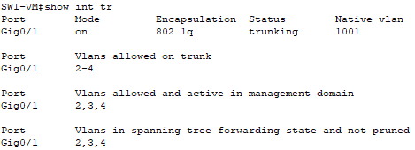 <br/>
> Como se puede observar, definí como VLAN nativa una VLAN que no se utiliza, para prevenir el tráfico sin tags por el enlace troncal, además, solo permití el trafico de las VLANs existentes, lo que significa que si se crea una nueva VLAN no se permitirá automáticamente en el enlace troncal, por lo que el administrador de red tiene un control más estricto sobre la misma.
> Esta misma configuración fue replicada tanto en el switch de Bariloche como en el switch Mendoza. <br/>
> ***Configuración de interfaces virtuales en el Router:***
> Para permitir la interconexión entre dispositivos que se encuentran en distintas VLANs, los mismos deben estar separados tanto en capa 2 como en capa 3, y la interconexión se da mediante un Router, con varias interfaces virtuales que funcionan como puerta de enlace predeterminada para cada una de estas redes por las que encamina el tráfico con el TAG de la VLAN correspondente. <br/>
> La configuración necesaria en cada interfaz virtual es: levantar la interfaz física, definir el protocolo de encapsulamiento (802.1q) e indicar el TAG correspondiente, y por último definir la dirección IP de la misma (y máscara), que se acordó sería el primero de cada red. <br/>
> Resultando en la siguiente configuración: <br/>
> ``` code
> interface GigabitEthernet0/0/0
>  no ip address
>  duplex auto
>  speed auto
> !
> interface GigabitEthernet0/0/0.2
>  encapsulation dot1Q 2
>  ip address 10.1.2.1 255.255.255.0
> !
> interface GigabitEthernet0/0/0.3
>  encapsulation dot1Q 3
>  ip address 10.1.3.1 255.255.255.0
> !
> interface GigabitEthernet0/0/0.4
>  encapsulation dot1Q 4
>  ip address 10.1.4.1 255.255.255.0
> ```
> Esta configuración se replicó tanto en Bariloche como en Mendoza.

## DHCP
Para la asignación de direcciones dinámica definí 3 esquemas distintos:
- En Villa María un servidor DHCP con dos interfaces Ethernet, una en la VLAN 2 y otra en la VLAN 3, y para asignar direcciones a la VLAN 4 definí una DHCP-pool en el Router.
- En Bariloche configuré la asignación de direcciones dinámica de las 3 VLANs directamente desde el router, esto es, con 3 DHCP-pools, una para cada VLAN.
- En Mendoza utilicé un servidor DHCP en cada VLAN.

### Villa María
Lo primero que tuve que hacer cuando puse el servidor DHCP para la VLAN 2 y 3 fue configurar los puertos del switch a los que conecté cada una de las interfaces de este servidor para que pertenezcan a las VLAN 3 y 4 respectivamente.
Una vez hecho esto configuré el servicio DHCP en cada interfaz de la siguiente manera, para que asigne direcciones IP dinámicamente a partir de la décima dirección de cada red: <br/>
 <br/>
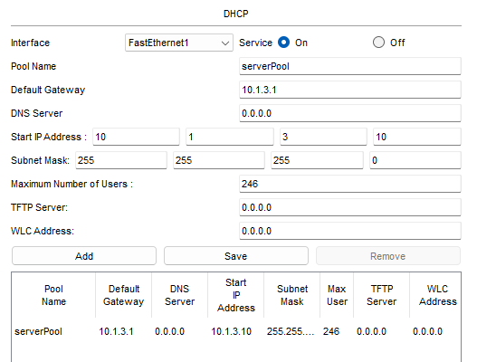 <br/>
Además, definí estáticamente el IP de cada interfaz del servidor DHCP como la segunda de la red a la que pertenece. <br/>

En cuanto a la VLAN 4 la configuración de la DHCP-pool en el router fue la siguiente, donde excluí las primeras 10 direcciones de la red para que no entre en conflicto con la dirección del Router ya que las direcciones IP deben ser únicas, además, esto me permite flexibilidad si el día de mañana deseo asignar alguna otra IP de forma estática, ya sea tanto para un servidor como para una impresora o cualquier otro dispositivo que lo requiera:
> ``` code	
> ip dhcp excluded-address 10.1.4.1 10.1.4.10
> !
> ip dhcp pool VLAN4
>  network 10.1.4.0 255.255.255.0
>  default-router 10.1.4.1
> !
> ```
> Resultando en: <br/>
>  <br/>

#### Router WiFi
Una cosa que me faltó aclarar es que para que los dispositivos que se encuentran en la VLAN 4 reciban información de red dinámicamente del servidor DHCP configurado en el Router, el Router WiFi al que se conectan debe estar funcionando en modo Bridge, esto se hace deshabilitando el DHCP del mismo y conectándolo al Switch mediante un puerto LAN y no mediante el puerto WAN. <br/>
Esto lo hice desde la GUI del mismo en la solapa de configuración-configuración básica. <br/>
Además definí un SSID denominado 'villamaria' y una contraseña bajo el protocolo WPA2 que definí como 'redes2022'. <br/>
Una vez configurado el Router WiFi en modo Bridge procedí a conectar tanto la tablet como la notebook al mismo.

De este modo la configuración DHCP de Villa María fue exitosa y todos los dispositivos en esta locación recibieron información de la red (Dirección IP, DG, etc.)

> ***Desactivando DHCP*** <br/>
> 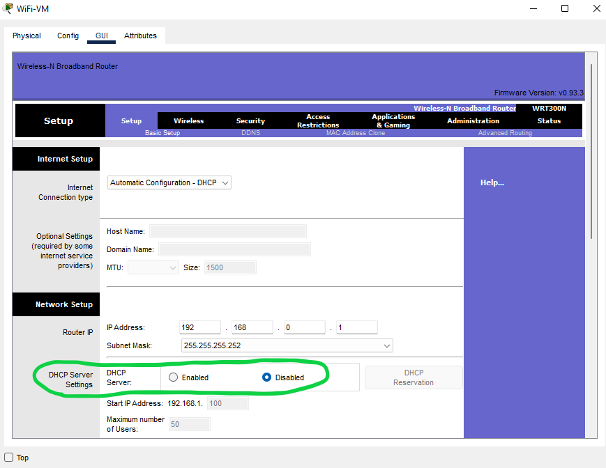 <br/>
> ***Configurando SSID*** <br/>
> 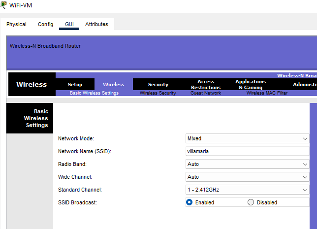 <br/>
> ***Configurando WPA2*** <br/>
> 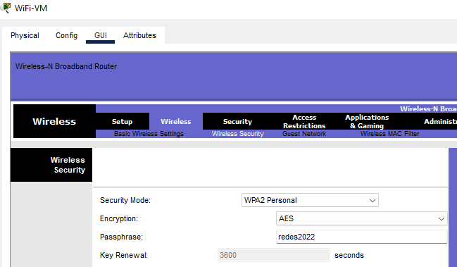 <br/>

Esta configuración se replicó tanto en Mendoza como en Bariloche cambiando el SSID por el de la localidad correspondiente.

### Bariloche
Como en bariloche no utilicé servidores DHCP físicos sino que configure 3 DHCP-pools en el Router, lo único que tuve que hacer fue crearlas y excluir las direcciones correspondientes:
- VLAN2: IP del Router
- VLAN3: IP del Router e IP de la Impresora
- VLAN4: IP del Router
La configuración fue la siguiente:
``` code
ip dhcp excluded-address 10.2.2.1 10.2.2.10
ip dhcp excluded-address 10.2.3.1 10.2.3.10
ip dhcp excluded-address 10.2.4.1 10.2.4.10
!
ip dhcp pool VLAN2
 network 10.2.2.0 255.255.255.0
 default-router 10.2.2.1
ip dhcp pool VLAN3
 network 10.2.3.0 255.255.255.0
 default-router 10.2.3.1
ip dhcp pool VLAN4
 network 10.2.4.0 255.255.255.0
 default-router 10.2.4.1
```
> Resultando en las siguientes DHCP-pools: <br/>
> 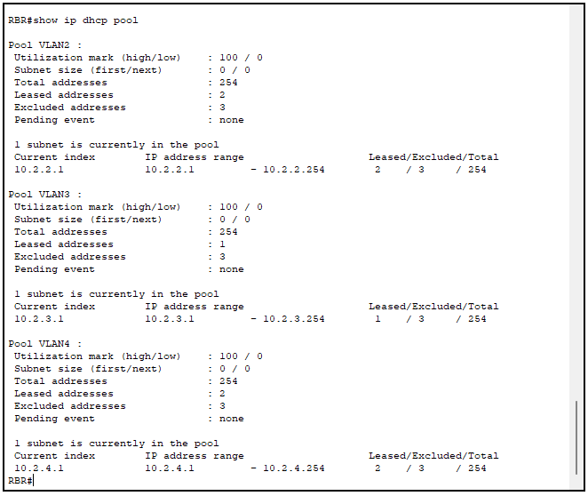

De esta manera todos los dispositivos en la red de Bariloche recibieron su IP correspondiente en el rango .10-.254

### Mendoza
Por último, en Mendoza configuré 3 servidores físicos, cada uno con una única interfaz física conectada a la VLAN correspondiente en la que asignará IPs. Muestro solo la parte física ya que la configuración es igual a lo hecho en Villa María con el servidor DHCP de las VLANs 2 y 3 <br/>
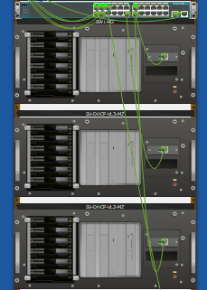

*La IP de las impresoras, tanto en BR, MZ y VM las configuré estáticamente.

Con estas configuraciones, la conectividad es TOTAL, dentro de cada oficina, es decir, los dispositivos entre distintas VLANs que se encuentran en al misma oficina se pueden comunicar a través del Router, solo faltaría configurar las rutas para que los Routers se informen de las redes que conocen y puedan popular su tabla de enrutamiento para permitir la conectividad total entre las 3 ciudades. <br/>
Pero primero, unas tablas en modo de resumen sobre la configuración realizada en cada ciudad.

## Tablas de resumen
***Villa María*** <br/>

| **Nombre**     | **Modelo** | **Interfaz** | **Dirección IP** | **Dirección de Red** | **Puerto del Switch** | **VLAN**    |
|----------------|------------|--------------|------------------|----------------------|-----------------------|-------------|
| **RVM**        | ISR4331    | g0/0/0.2     | 10.1.2.1/24      | 10.1.2.0/24          | g0/0 (TRUNK)          | 2 (tag .1q) |
| **RVM**        | ISR4331    | g0/0/0.3     | 10.1.3.1/24      | 10.1.3.0/24          | g0/0 (TRUNK)          | 3 (tag .1q) |
| **RVM**        | ISR4331    | g0/0/0.4     | 10.1.4.1/24      | 10.1.4.0/24          | g0/0 (TRUNK)          | 4 (tag .1q) |
| **PC1-VM**     | PC         | Fa0          | DHCP (+.10)      | 10.1.2.0/24          | fa0/1 (ACCESS)        | 2           |
| **PC2-VM**     | PC         | Fa0          | DHCP (+.10)      | 10.1.2.0/24          | fa0/2 (ACCESS)        | 2           |
| **PC3-VM**     | PC         | Fa0          | DHCP (+.10)      | 10.1.3.0/24          | fa0/3 (ACCESS)        | 3           |
| **Pr1-VM**     | Printer    | Fa0          | 10.1.3.3/24      | 10.1.3.0/24          | fa0/4 (ACCESS)        | 3           |
| **WiFi-VM**    | WRT-300N   | Ethernet 1   | -                | -                    | fa0/5                 | 4           |
| **Nb1-VM**     | Notebook   | Wi0          | DHCP (+.10)      | 10.1.4.0/24          | *Wi del WRT300N       | 4           |
| **Tb1-VM**     | Tablet     | Wi0          | DHCP (+.10)      | 10.1.4.0/24          | *Wi del WRT300N       | 4           |
| **DHCP-SV-VM** | Server     | Fa0          | 10.1.2.2/24      | 10.1.2.0/24          | fa0/20                | 2           |
| **DHCP-SV-VM** | Server     | Fa1          | 10.1.3.2/24      | 10.1.3.0/24          | fa0/23                | 3           |

***Bariloche***
| **Nombre**  | **Modelo** | **Interfaz** | **Dirección IP** | **Dirección de Red** | **Puerto del Switch** | **VLAN**    |
|-------------|------------|--------------|------------------|----------------------|-----------------------|-------------|
| **RBR**     | ISR4331    | g0/0/0.2     | 10.2.2.1/24      | 10.2.2.0/24          | g0/0 (TRUNK)          | 2 (tag .1q) |
| **RBR**     | ISR4331    | g0/0/0.3     | 10.2.3.1/24      | 10.2.3.0/24          | g0/0 (TRUNK)          | 3 (tag .1q) |
| **RBR**     | ISR4331    | g0/0/0.4     | 10.2.4.1/24      | 10.2.4.0/24          | g0/0 (TRUNK)          | 4 (tag .1q) |
| **PC1-BR**  | PC         | Fa0          | DHCP (+.10)      | 10.2.2.0/24          | fa0/1 (ACCESS)        | 2           |
| **PC2-BR**  | PC         | Fa0          | DHCP (+.10)      | 10.2.2.0/24          | fa0/2 (ACCESS)        | 2           |
| **PC3-BR**  | PC         | Fa0          | DHCP (+.10)      | 10.2.3.0/24          | fa0/3 (ACCESS)        | 3           |
| **Pr1-BR**  | Printer    | Fa0          | 10.2.3.3/24      | 10.2.3.0/24          | fa0/4 (ACCESS)        | 3           |
| **WiFi-BR** | WRT-300N   | Ethernet 1   | -                | -                    | fa0/5                 | 4           |
| **Nb1-BR**  | Notebook   | Wi0          | DHCP (+.10)      | 10.2.4.0/24          | *Wi del WRT300N       | 4           |
| **Tb1-BR**  | Tablet     | Wi0          | DHCP (+.10)      | 10.2.4.0/24          | *Wi del WRT300N       | 4           |

***Mendoza***
| **Nombre**         | **Modelo** | **Interfaz** | **Dirección IP** | **Dirección de Red** | **Puerto del Switch** | **VLAN**    |
|--------------------|------------|--------------|------------------|----------------------|-----------------------|-------------|
| **RMZ**            | ISR4331    | g0/0/0.2     | 10.2.2.1/24      | 10.2.2.0/24          | g0/0 (TRUNK)          | 2 (tag .1q) |
| **RMZ**            | ISR4331    | g0/0/0.3     | 10.2.3.1/24      | 10.2.3.0/24          | g0/0 (TRUNK)          | 3 (tag .1q) |
| **RMZ**            | ISR4331    | g0/0/0.4     | 10.2.4.1/24      | 10.2.4.0/24          | g0/0 (TRUNK)          | 4 (tag .1q) |
| **PC1-MZ**         | PC         | Fa0          | DHCP (+.10)      | 10.2.2.0/24          | fa0/1 (ACCESS)        | 2           |
| **PC2-MZ**         | PC         | Fa0          | DHCP (+.10)      | 10.2.2.0/24          | fa0/2 (ACCESS)        | 2           |
| **PC3-MZ**         | PC         | Fa0          | DHCP (+.10)      | 10.2.3.0/24          | fa0/3 (ACCESS)        | 3           |
| **Pr1-MZ**         | Printer    | Fa0          | 10.2.3.3/24      | 10.2.3.0/24          | fa0/4 (ACCESS)        | 3           |
| **WiFi-MZ**        | WRT-300N   | Ethernet 1   | -                | -                    | fa0/5                 | 4           |
| **Nb1-MZ**         | Notebook   | Wi0          | DHCP (+.10)      | 10.2.4.0/24          | *Wi del WRT300N       | 4           |
| **Tb1-MZ**         | Tablet     | Wi0          | DHCP (+.10)      | 10.2.4.0/24          | *Wi del WRT300N       | 4           |
| **SV-DHCP-VL2-MZ** | Server     | Fa0          | 10.3.2.2/24      | 10.3.2.0/24          | fa0/12                | 2           |
| **SV-DHCP-VL3-MZ** | Server     | Fa0          | 10.3.3.2/24      | 10.3.3.0/24          | fa0/13                | 3           |
| **SV-DHCP-VL4-MZ** | Server     | Fa0          | 10.3.4.2/24      | 10.3.4.0/24          | fa0/14                | 4           |

# Configuración de protocolo dinámico de enrutamiento

Por último, para permitir la conectividad entre las redes de las 3 ciudades, los routers deben informar sobre las redes directamente conectadas a los mismos a los demás routers, para esto utilizamos el protocolo RIP (Routing Information Protocol). 

La configuración de RIP en la CLI de Cisco se da con los siguientes comandos:
- router rip: para ingresar a la configuración del protocolo en el router
- version 2: para especificar que queremos utilizar RIPv2, ya que RIPv1 no soporta CIDR, y las redes que utilizamos en el laboratorio son todas CIDR. (Clase A con máscara 24)
- no auto-summary: para evitar la sumarización de rutas a la hora de enviar RIP updates. (si no se desactiva podría generar conflictos ya que se podrían sumarizar todas las rutas como una única ruta de clase A con máscara 24)
- network A.B.C.D: este comando se utiliza para especificar en que interfaces del router queremos activar RIP para informar de sus redes a los demás vecinos. La dirección que se especifica en este comando es classfull, lo que significa que se aplica el and lógico con la máscara por defecto de la clase a la que pertenece la dirección, y todas las redes que caigan en ese rango serán informadas.

Por lo tanto la configuración en los 3 routers es la siguiente:
``` code
router rip
 version 2
 network 10.0.0.0
 no auto-summary
!
```
Resultando en:
> ***Villa María***: <br/>
> Información de RIP: <br/>
>  <br/>
> Tabla de enrutamiento: <br/>
>  <br/>
> ***Bariloche***: <br/>
> Información de RIP: <br/>
> 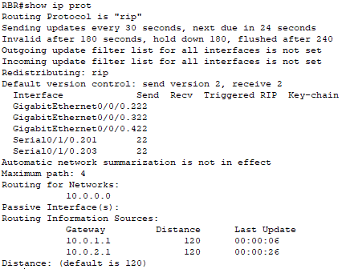 <br/>
> Tabla de enrutamiento: <br/>
>  <br/>
> ***Mendoza***: <br/>
> Información de RIP: <br/>
>  <br/>
> Tabla de enrutamiento: <br/>
>  <br/>

Como se puede ver, cada router compartió su tabla de enrutamiento con los demás y todos los routers aprendieron todas las rutas a todas las redes de la compañía. 

Con esta última configuración la conectividad es total.

# Vista Lógica Total
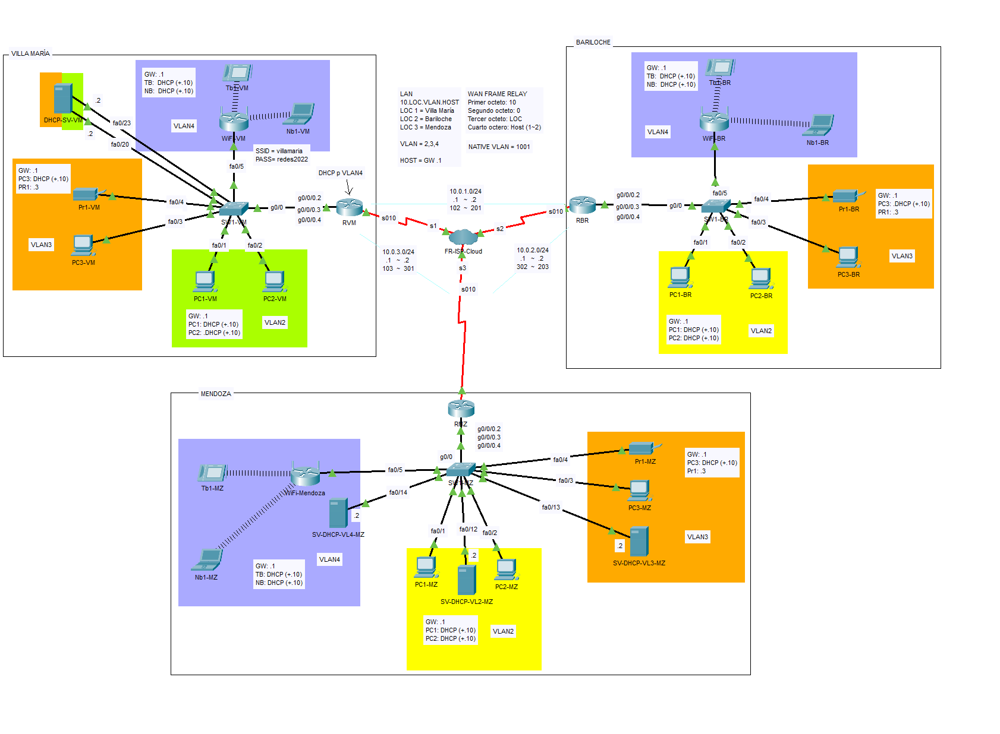